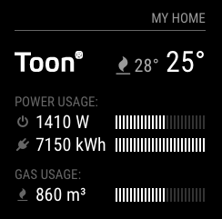

# Module: MMM-Toon
This MagicMirror modules allows you to show your processor temperature on you mirror. Currently it only works with a Raspberry Pi.


## Installation

In your terminal, go to your MagicMirror's Module folder:
````
cd ~/MagicMirror/modules
````

Clone this repository:
````
git clone https://github.com/MichMich/MMM-Toon.git
````

Configure the module in your `config.js` file.

## Example



The module displays the following information:

* A symbol to show if the heater is currently active.
* The target temperature.
* The current temperature.
* The current power consumption.
* The total power consumption for the current day.
* The total gas consumption for the current day.

## Using the module

To use this module, add it to the modules array in the `config/config.js` file:
````javascript
modules: [
    {
        module: 'MMM-Toon',
        position: 'top_right', // This can be any of the regions.
        config: {
            apiKey: 'your_api_key', // Obtained from toonapi.com
            apiSecret: 'your_api_secred', // Obtained from toonapi.com
            username: 'your_toon_username',
            password: 'your_toon_password'
        }
    }
]
````

## Configuration options

The following properties can be configured:


<table width="100%">
	<!-- why, markdown... -->
	<thead>
		<tr>
			<th>Option</th>
			<th width="100%">Description</th>
		</tr>
	<thead>
	<tbody>

		<tr>
			<td><code>apiKey</code></td>
			<td><b>Required</b></code> - Your Toon API Key. Obtained from [toonapi.com](http://toonapi.com).</td>
		</tr>
        <tr>
			<td><code>apiSecret</code></td>
			<td><b>Required</b></code> - Your Toon API Secret. Obtained from [toonapi.com](http://toonapi.com).</td>
		</tr>
        <tr>
			<td><code>username</code></td>
			<td><b>Required</b></code> - Your Toon username.</td>
		</tr>
        <tr>
			<td><code>password</code></td>
			<td><b>Required</b></code> - Your Toon password.</td>
		</tr>
	</tbody>
</table>

---
<p align="center">
    <br>
    This module is powered by the Toon® API.
</p>
